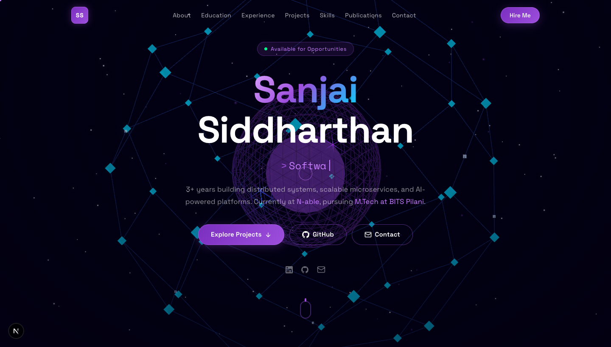

<div align="center">

# Sanjai Siddharthan — Portfolio

A futuristic, **3D-immersive** personal portfolio built around an interactive WebGL "neural graph" — a living visualization of distributed systems, neural networks, and vector space.

[](https://nextjs.org/)
[](https://react.dev/)
[](https://www.typescriptlang.org/)
[](https://threejs.org/)
[](https://tailwindcss.com/)
[](https://vercel.com/)



</div>

---

## ✨ Concept

Instead of a generic template, the entire site is built around an interactive 3D **neural graph** that reads as a distributed-system topology, a neural network, and a vector field all at once — the three domains the work spans. A glowing core sits at the center, ~46 nodes connect across a sphere, and data packets flow along the edges. The scene reacts to your mouse (parallax) and to scroll (rotates and shifts color from violet → cyan), all finished with cinematic bloom.

## 🚀 Features

- **Interactive 3D background** — a React Three Fiber neural-graph scene with mouse parallax, scroll-driven motion, animated data packets, and post-processing bloom.
- **Cinematic boot loader** — a terminal-style boot sequence on first load.
- **Custom cursor** — a trailing ring that reacts to interactive elements (desktop only; touch devices keep the native cursor).
- **Scroll animations** — section reveals powered by Framer Motion.
- **Fully responsive** — alternating readable panels over the dimmed 3D backdrop; mobile menu below `lg`.
- **Graceful WebGL fallback** — devices without WebGL get a static cosmic gradient instead of a blank canvas.
- **Accessible & SEO-ready** — semantic sections, Open Graph metadata, reduced visual load on touch.

## 🗂️ Sections

`Hero` · `About` · `Education` · `Experience` · `Projects` · `Skills` · `Achievements` · `Publications` · `Contact`

## 🛠️ Tech Stack

| Area | Tools |
| --- | --- |
| Framework | [Next.js 16](https://nextjs.org/) (App Router) · React 19 |
| Language | TypeScript |
| Styling | Tailwind CSS v4 · CSS custom properties |
| 3D / WebGL | [Three.js](https://threejs.org/) · [@react-three/fiber](https://github.com/pmndrs/react-three-fiber) · [@react-three/drei](https://github.com/pmndrs/drei) · [@react-three/postprocessing](https://github.com/pmndrs/react-postprocessing) |
| Animation | [Framer Motion](https://www.framer.com/motion/) |
| Icons | [Lucide React](https://lucide.dev/) |
| Fonts | Space Grotesk · Space Mono (`next/font`) |
| Hosting | [Vercel](https://vercel.com/) |

## 📦 Getting Started

**Prerequisites:** Node.js 20.9+ and npm.

```bash
# Install dependencies
npm install

# Start the dev server (http://localhost:3000)
npm run dev

# Build for production
npm run build

# Run the production build locally
npm start
```

### Scripts

| Command | Description |
| --- | --- |
| `npm run dev` | Start the development server |
| `npm run build` | Create an optimized production build |
| `npm start` | Serve the production build |
| `npm run lint` | Run ESLint |

## 📁 Project Structure

```
sanjai-portfolio/
├── app/
│   ├── globals.css        # Theme tokens, utilities, animations
│   ├── layout.tsx         # Root layout, fonts, metadata
│   └── page.tsx           # Page composition + section panels
├── components/
│   ├── Scene3D.tsx        # The 3D neural-graph WebGL scene
│   ├── Scene3DWrapper.tsx # Client-only loader + WebGL fallback + scroll tracking
│   ├── Cursor.tsx         # Custom trailing cursor
│   ├── Loader.tsx         # Cinematic boot-sequence loader
│   ├── Navbar.tsx         # Sticky nav + mobile menu
│   ├── Hero.tsx           # Landing section (typewriter role)
│   ├── About.tsx          # Bio + stats
│   ├── Education.tsx       # Degrees, CGPA, WILP status
│   ├── Experience.tsx     # Career timeline
│   ├── Projects.tsx       # Project cards (GitHub / Devpost links)
│   ├── Skills.tsx         # Categorized tech stack
│   ├── Achievements.tsx   # Awards & recognition
│   ├── Publications.tsx   # Research papers
│   └── Contact.tsx        # Contact cards + CTA
├── lib/
│   └── scroll.ts          # Shared scroll progress (read inside the render loop)
├── docs/
│   └── preview.png        # README preview image
└── public/                # Static assets
```

## 🎨 Customization

Most content lives in typed data arrays at the top of each component — edit those, no layout changes needed:

| To change… | Edit |
| --- | --- |
| Projects | `PROJECTS` in [`components/Projects.tsx`](components/Projects.tsx) |
| Experience | `EXPERIENCES` in [`components/Experience.tsx`](components/Experience.tsx) |
| Education | `EDUCATION` in [`components/Education.tsx`](components/Education.tsx) |
| Skills | `SKILL_GROUPS` in [`components/Skills.tsx`](components/Skills.tsx) |
| Awards | `ACHIEVEMENTS` in [`components/Achievements.tsx`](components/Achievements.tsx) |
| Nav links | `NAV_LINKS` in [`components/Navbar.tsx`](components/Navbar.tsx) |

**Theme palette** (in `globals.css` and inline styles): violet `#9D4EDD`, cyan `#00d9ff`, accent `#C77DFF`, background `#020012`.

**3D tuning** — in [`components/Scene3D.tsx`](components/Scene3D.tsx): adjust `Bloom` `intensity` for glow strength, `NODE_COUNT` / `PACKET_COUNT` for density, and the node/packet emissive values for brightness.

**Section shading** — `BAND_A` / `BAND_B` in [`app/page.tsx`](app/page.tsx) control the alternating readable panels behind content.

## ☁️ Deployment

This site deploys to [Vercel](https://vercel.com/) with zero configuration — no environment variables required.

1. Push the repository to GitHub.
2. Import the repo at [vercel.com/new](https://vercel.com/new).
3. Vercel auto-detects Next.js and deploys. Every push to the default branch ships a new deployment.

> The 3D scene and post-processing bloom add to the client bundle — expected for a WebGL-heavy site and fine for static hosting.

## 📬 Contact

- **Email:** sanjaisiddharth2002@gmail.com
- **LinkedIn:** [sanjai-s-8126091b3](https://www.linkedin.com/in/sanjai-s-8126091b3/)
- **GitHub:** [SSpirate11](https://github.com/SSpirate11)
- **Devpost:** [sanjaisiddharth2002](https://devpost.com/sanjaisiddharth2002)

---

<div align="center">

Built with Next.js, Three.js & Framer Motion.

</div>
